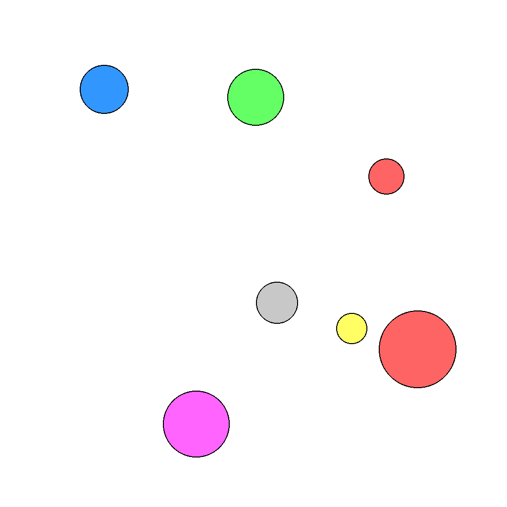
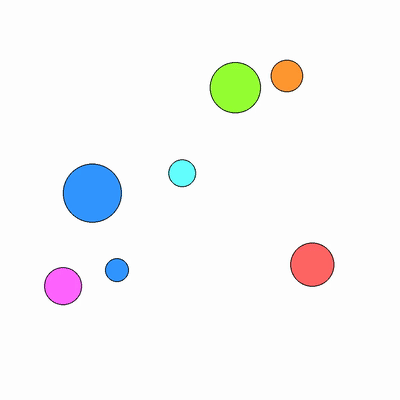
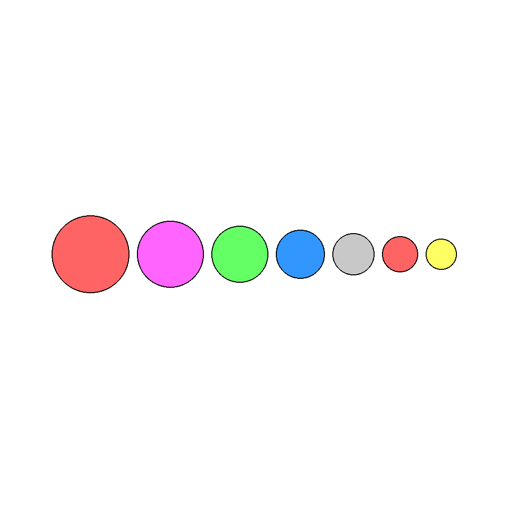

# G-174: Arrange Circles By Circumference Data Generator

Generates synthetic tasks where circles of different sizes and colors are randomly arranged. The goal is to rearrange them on a horizontal line, sorted by circumference from largest to smallest.

Each sample pairs a **task** (first frame + prompt describing what needs to happen) with its **ground truth solution** (final frame showing the result + video demonstrating how to achieve it). This structure enables both model evaluation and training.

---

## 📌 Basic Information

| Property | Value |
|----------|-------|
| **Task ID** | G-174 |
| **Task** | Arrange Circles By Circumference |
| **Category** | Sorting & Spatial Reasoning |
| **Resolution** | 1024×1024 px |
| **FPS** | 16 fps |
| **Duration** | ~5 seconds |
| **Output** | PNG images + MP4 video |

---

## 🚀 Usage

### Installation

```bash
# Clone the repository
git clone https://github.com/Jiaqi-Gong/Gong_VBVR_Data.git
cd Gong_VBVR_Data/G-174_arrange_circles_by_circumference_data-generator

# Install dependencies
pip install -r requirements.txt
```

### Generate Data

```bash
# Generate 100 samples
python examples/generate.py --num-samples 100

# Generate with specific seed
python examples/generate.py --num-samples 100 --seed 42

# Generate without videos
python examples/generate.py --num-samples 100 --no-videos

# Custom output directory
python examples/generate.py --num-samples 100 --output data/my_output
```

### Command-Line Options

| Argument | Type | Description | Default |
|----------|------|-------------|---------|
| `--num-samples` | int | Number of samples to generate | 100 |
| `--seed` | int | Random seed for reproducibility | Random |
| `--output` | str | Output directory | data/questions |
| `--no-videos` | flag | Skip video generation | False |

---

## 📖 Task Example

### Prompt

```
The scene shows 7 circles of different sizes and colors arranged randomly.
Keep every circle unchanged in size and color. Only rearrange their positions.
Align all circles on a single horizontal line. Center the entire row of circles in the image.
Sort them from left to right by circumference, from largest to smallest.
```

### Visual

<table>
<tr>
  <td align="center"></td>
  <td align="center"></td>
  <td align="center"></td>
</tr>
<tr>
  <td align="center"><b>Initial Frame</b><br/>Circles randomly arranged</td>
  <td align="center"><b>Animation</b><br/>Circles moving to sorted positions</td>
  <td align="center"><b>Final Frame</b><br/>Circles sorted by circumference, largest to smallest</td>
</tr>
</table>

---

## 📖 Task Description

### Objective

Rearrange randomly placed circles onto a horizontal line, sorted by their circumference (largest to smallest from left to right), while preserving their size and color.

### Task Setup

- **Circle Count**: 5-10 circles per image
- **Circle Radius**: 30-80 pixels (varied sizes)
- **Radius Constraints**: 
  - Minimum 4-pixel gap between any two radii (ensures unique ordering)
  - Minimum 1.15× ratio between adjacent sorted radii (ensures visually obvious differences)
- **Color Palette**: 10 distinct colors for easy visual tracking
- **Alignment**: All circles aligned horizontally at image center
- **Spacing**: Minimum 16-pixel gap between circles when aligned

### Key Features

- **Size-based sorting**: Circles sorted by circumference (2πr), equivalent to sorting by radius
- **Visual clarity**: Significant size differences between adjacent circles (≥15% larger)
- **Color preservation**: Circle colors remain unchanged during rearrangement
- **Centered layout**: Final arrangement centered horizontally and vertically
- **Smooth animation**: 5-second animation showing circles moving to their sorted positions
- **No overlaps**: Adequate spacing ensures circles never overlap in initial or final states

---

## 📦 Data Format

```
data/questions/arrange_circles_by_circumference_task/
├── arrange_circles_by_circumference_0000/
│   ├── first_frame.png          # Initial state (random arrangement)
│   ├── final_frame.png          # Goal state (sorted by circumference)
│   ├── prompt.txt               # Task instructions
│   └── ground_truth.mp4         # Solution video (16 fps)
├── arrange_circles_by_circumference_0001/
│   └── ...
```

**File specifications**: Images are 1024×1024 PNG. Videos are MP4 at 16 fps, approximately 5 seconds long showing the rearrangement process.

---

## 🏷️ Tags

`sorting` `geometry` `circumference` `spatial-arrangement` `size-comparison` `ordering`

---
